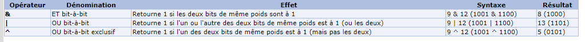
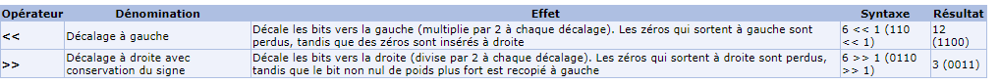

# 5. Minitalk

Mark: 125/100  
Themes: UNIX signals/ processeur ID et Opérateurs bits  
The purpose of this project is to code a small data exchange program using *UNIX signals*.

### Mandatory

- Produce `server` & `client` executables
- `client` must communicate a string passed as a parameter to `server` *(referenced by its process ID)* which then displays it
- Use `SIGUSR1` & `SIGUSR2` signals **ONLY**

### Bonus

- Add reception acknowledgement system
- Support Unicode characters

### Allowed Functions

- [`malloc`](https://man7.org/linux/man-pages/man3/free.3.html)
- [`free`](https://man7.org/linux/man-pages/man3/free.3.html)
- [`write`](https://man7.org/linux/man-pages/man2/write.2.html)
- [`getpid`](https://man7.org/linux/man-pages/man2/getpid.2.html)
- [`signal`](https://man7.org/linux/man-pages/man2/signal.2.html)
- [`sigemptyset & sigaddset`](https://man7.org/linux/man-pages/man3/sigsetops.3.html)
- [`sigaction`](https://man7.org/linux/man-pages/man2/sigaction.2.html)
- [`pause`](https://man7.org/linux/man-pages/man2/pause.2.html)
- [`kill`](https://man7.org/linux/man-pages/man2/kill.2.html)
- [`sleep`](https://man7.org/linux/man-pages/man3/sleep.3.html)
- [`usleep`](https://man7.org/linux/man-pages/man3/usleep.3.html)
- [`exit`](https://man7.org/linux/man-pages/man3/exit.3.html)

<details>
    <summary>DETAILS DU CHEMINEMENT</summary>
```
#include <sys/types.h>
#include <signal.h>
```

## FUNCTIONS ALLOWED AND UNIX SIGNALS

- ALLOWED FUNCTIONS
    
    [FUNCTIONS ALLOWED](https://www.notion.so/a41d5179b185456d9aa94c4121ec089c)
    
- SIGACTION FONCTION AND STRUCTURE
    
    ```
    #include <signal.h>
    
    int sigaction(int signum, const struct sigaction *restrict act,
                         struct sigaction *restrict oldact);
    ```
    
    - **The sigaction() system call is used to change the action taken by a process on receipt of a specific signal. (See signal(7) for an overview of signals.)**
    - **signum specifies the signal and can be any valid signal except SIGKILL and SIGSTOP.**
    - **The sigaction() system call is used to change the action taken by a process on receipt of a specific signal. (See signal(7) for an overview of signals.)**
    - **signum specifies the signal and can be any valid signal except SIGKILL and SIGSTOP.**
    - **If act is non-NULL, the new action for signal signum is installed from act. If oldact is non-NULL, the previous action is saved in oldact.**
    
    ```
     struct sigaction {
               void     (*sa_handler)(int);
               void     (*sa_sigaction)(int, siginfo_t *, void *);
               sigset_t   sa_mask;
               int        sa_flags;
               void     (*sa_restorer)(void);
            };
    ```
    
    **Important: If SA_SIGINFO is specified in sa_flags, then sa_sigaction (instead of sa_handler) specifies the signal-handling function for signum. This function receives three arguments, as described below.**
    
- UNIX SIGNAL SENDING A SIGNAL
    
    Sending a signal The following system calls and library functions allow the caller to send a signal:
    
    - [raise(3)] Sends a signal to the calling thread.
    - **kill(2)** Sends a signal to a specified process, to all members of a specified process group, or to all processes on the system.
    - pidfd_send_signal(2) Sends a signal to a process identified by a PID file descriptor.
    - [killpg(3)](https://man7.org/linux/man-pages/man3/killpg.3.html) Sends a signal to all of the members of a specified process group.
    - [pthread_kill(3)](https://man7.org/linux/man-pages/man3/pthread_kill.3.html) Sends a signal to a specified POSIX thread in the same process as the caller.
    - [tgkill(2)](https://man7.org/linux/man-pages/man2/tgkill.2.html) Sends a signal to a specified thread within a specific process. (This is the system call used to implement pthread_kill(3).)
    - [sigqueue(3)](https://man7.org/linux/man-pages/man3/sigqueue.3.html) Sends a real-time signal with accompanying data to a specified process.
    - ** Waiting for a signal to be caught
    - [pause(2)](https://man7.org/linux/man-pages/man2/pause.2.html) Suspends execution until any signal is caught.
    - [sigsuspend(2)](https://man7.org/linux/man-pages/man2/sigsuspend.2.html) Temporarily changes the signal mask (see below) and suspends execution until one of the unmasked signals is caught.

**Important: signal handlers run asynchronously that means that they can interrump your code at any point That's why is recommendable to use write instead of printf**

- SOME BASIC SIGNALS SIGKILL SIGSTOP SIGCONT
    - finish a process
    
    `kill -SIGKILL <pid>`
    
    - pause a process
    
    ```
    kill -SIGSTOP <pid>
    ```
    
    - * sigcont to continue the process that is in pause
    
    `kill -SIGCONT <pid>`
    

## GOAL : HOW TO COMMUNICATE WITH SIGNALS ?

- BITS
    - 128 is 10000000. This will be our mask to then compare with "&" and *** client:
    - Goal: send the message with the pid process
    - Convert ASCII character to Binary character
    - Signal use
- BINARY OPERATORS
    
    
    
    
    
- UTF-8
    
    UTF-8 (abréviation de l'anglais Universal Character Set Transformation Format1 - 8 bits) est un codage de caractères informatiques conçu pour coder l'ensemble des caractères du « répertoire universel de caractères codés », initialement développé par l'ISO dans la norme internationale ISO/CEI 10646, aujourd'hui totalement compatible avec le standard Unicode, en restant compatible avec la norme ASCII limitée à l'anglais de base, mais très largement répandue depuis des décennies.
    
- How does it works?
    - A character = a byte = 8 bits ( either 1 or 0)
    - I send 8 signals, one for each bit.
    - SIGUSR1 for 1 SIGUSR2 for 0.
    - I use the binary operators to move the bits either on left or right.
    - the server receives and writes the character associated to the 8 bits, therefore the byte.

# My functions :

## CLIENT :

```bash
int main (int argc, char **argv):
initialise la structure
verif qu'il a deux arguments et que le deuxieme est bien une str non nulle

sa_handler devient ft_count ---> pour la reception des signaux de retour du serveur
sa_flags devient SA_SIGINFO ---> pour la recup client pid par le serveur

static void ft_send(int s_pid, char *str):
 envoie char par char grace a la variable char_send
envoie bit par bit grace a aux operateurs binaire >> et &
lorsque c est 1 SIGUSR2 et 0 SIGUSR1
```

## SERVER :

```bash
int main (int argc, char **argv):
initialise la structure
print le pid du serveur

sa_sigaction devient ft_receive ---> pour la reception des signaux du client et l impression
sa_flags devient SA_SIGINFO ---> pour la recup client pid par le serveur

static void	ft_receive(int signum, siginfo_t *siginfo, void *context):
initialisations des variables locales statiques --car on a besoin de garder leurs valeurs entre chaque executions
-si sigusr2 alors chartoprint = chartoprint ou 1 on ajoute un 1 tout a droite 
puis si i!=8 on decale chartoprint a gauche
	si i==8 alors i=0 si chartoprint = 0 alors c_pid =0 sinon on print et char_toprint=0  
```
</details>
